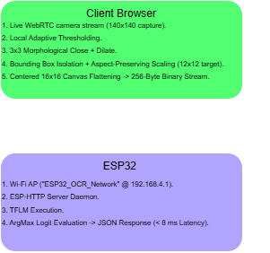
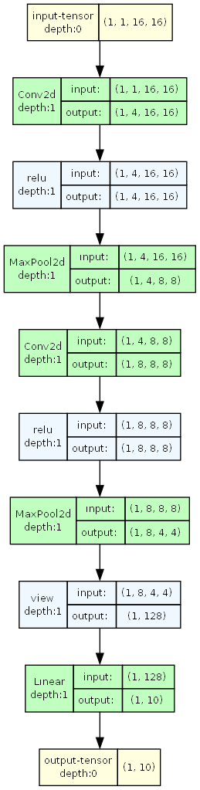
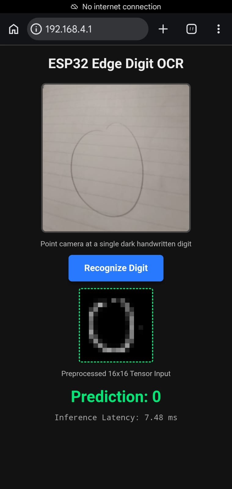
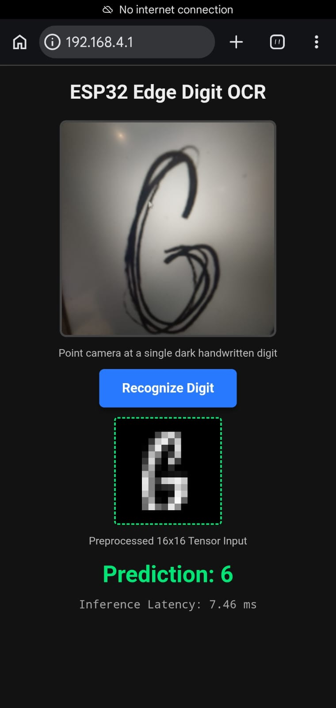
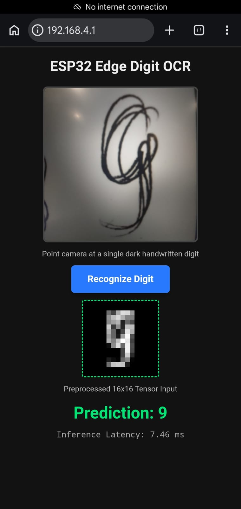

# ESP32-Digit-Recognition
An on-edge OCR system running on ESP32. This project classifies handwritten digits (0-9) locally using a custom quantized INT8 Micro-CNN deployed with TensorFlow Lite for Microcontrollers (TFLM), achieving < 8 ms inference latency with a 3.1 KB static memory footprint.



## ⚡ Key Technical Features

* **Zero ESP32 Vision Compute Overhead:** The entire vision processing pipeline (adaptive thresholding, morphology, and aspect-scaling) executes on the client device in JavaScript using native HTML5 Canvas and TypedArrays, offloading all image processing from the microcontroller.
* **Full INT8 Quantization:** PyTorch model converted via ONNX and TFLite Post-Training Quantization (PTQ) to pure 8-bit integer precision, reducing weight size by **75%** and utilizing ESP-NN SIMD instructions.
* **Zero Dynamic Heap Allocations:** Zero `malloc`/`free` calls during inference. The execution graph operates within a statically allocated **$3,100\text{ bytes}$ Tensor Arena** (`alignas(16)`).
* **Zero-Copy TCP Streaming:** The HTTP POST handler streams raw socket chunks directly into the neural network's input tensor pointer.

## 📊 Hardware & Model Specifications

| **Parameter**           | **Specification**                                                |
| ----------------------- | ---------------------------------------------------------------- |
| **Target SoC**          | ESP32 (Xtensa Dual-Core LX6 @ 160/240 MHz)                       |
| **Framework**           | ESP-IDF (v5.x / v6.x) + TensorFlow Lite Micro                    |
| **Input Tensor Shape**  | `[1, 16, 16, 1]` (256 signed `int8` elements)                    |
| **Model Parameters**    | 1,626 parameters (~1.6 KB INT8 weights)                          |
| **Static Tensor Arena** | **3,100 bytes** (Confirmed via `arena_used_bytes()`)             |
| **Inference Latency**   | **~7.5 ms** (Measured via hardware timer `esp_timer_get_time()`) |
| **Network Footprint**   | Standalone AP (`192.168.4.1`)                                |

## 🚀 Quick Start Guide

### 1. Build and Flash the ESP32 Firmware

Ensure ESP-IDF is sourced and available in your environment:

```bash
cd esp_code
idf.py set-target esp32
idf.py build
idf.py -p <YOUR_PORT> flash monitor
```

### 2. Connect and Run Inference

1. On your smartphone or laptop, connect to the ESP32 Wi-Fi network:

   * **SSID:** `ESP32_OCR_Network`
   * **Password:** `digit123`

2. Open any web browser and navigate to:

```text
http://192.168.4.1
```

3. Allow camera access, point the viewfinder at a dark handwritten digit on white paper, and tap **Recognize Digit**.


## Neural Network Microarchitecture


## 🧠 Model Architecture

| **Layer**         | **Input Shape**  | **Output Shape** |           **Weight Parameters** |
| ----------------- | ---------------- | ---------------- | ------------------------------: |
| Conv2D (3×3, s=1) | `[1, 16, 16, 1]` | `[1, 16, 16, 4]` |            `(3×3×1 + 1)×4 = 40` |
| MaxPool2D (2×2)   | `[1, 16, 16, 4]` | `[1, 8, 8, 4]`   |                               0 |
| Conv2D (3×3, s=1) | `[1, 8, 8, 4]`   | `[1, 8, 8, 8]`   |           `(3×3×4 + 1)×8 = 296` |
| MaxPool2D (2×2)   | `[1, 8, 8, 8]`   | `[1, 4, 4, 8]`   |                               0 |
| Flatten / Reshape | `[1, 4, 4, 8]`   | `[1, 128]`       |                               0 |
| Fully Connected   | `[1, 128]`       | `[1, 10]`        |          `(128 + 1)×10 = 1,290` |
| **TOTAL**         |                  |                  | **1,626 params (~1.6 KB INT8)** |


Softmax was stripped for edge deployment to save memory and eliminate expensive runtime floating-point exponentials.


## Training Strategy, Domain Adaptation & Quantization Flow
Two datasets were used in this project:
### 1. Pre-Training Dataset: USPS Handwritten Digits
- Used for initial baseline training of the custom Micro-CNN.
- Format: Fixed 16 * 16 grayscale images stored as flattened 256-element floating-point feature vectors.
- 7,291 training samples and 2,007 test samples across 10 digit classes (0 - 9).

### 2. Fine-Tuning Dataset: The Char74k Dataset
- Used for domain adaptation by running the raw images through the custom OpenCV pipeline to fine-tune the classification head on preprocessed camera-style handwriting.
- Total size of 550 images split into 80%-20% train-test sets.

## 🔄 Model Conversion & Deployment Pipeline

```text
PyTorch Model (.pth)
         │
         │ torch.onnx.export
         ▼
ONNX Graph (NCHW)
         │
         │ onnx2tf
         │ Transposes convolution filters
         │ to channels-last layout
         ▼
TensorFlow SavedModel (NHWC)
         │
         │ tf.lite.TFLiteConverter
         │ + Representative Dataset Calibration
         ▼
Full INT8 TFLite Model (.tflite)
         │
         │ Hex-dump serializer
         ▼
model.h
alignas(16) const unsigned char model_tflite[]
```

## Sample Results


.jpeg)




